Documentación técnica sobre cómo está construido, desplegado y gestionado este sitio (`docs.herwingx.dev`).

## 🛠️ Stack Tecnológico

| Componente | Tecnología | Propósito |
|:-----------|:-----------|:----------|
| **Core** | [Astro](https://astro.build) v5 | Framework web estático de alto rendimiento. |
| **Tema** | [Starlight](https://starlight.astro.build) | Plantilla de documentación optimizada. |
| **CMS** | [Sveltia CMS](https://github.com/sveltia/sveltia-cms) | Editor visual de contenido (Git-based). |
| **Hosting** | [GitHub Pages](https://pages.github.com) | Alojamiento gratuito y rápido para sitios estáticos. |
| **Auth** | [Cloudflare Workers](https://workers.cloudflare.com) | Proxy Serverless para autenticación OAuth segura. |
| **Dominio** | [Cloudflare DNS](https://dash.cloudflare.com) | Gestión de DNS y SSL. |

---

## 🚀 Flujo de Despliegue (CI/CD)

El sitio utiliza **GitHub Actions** para construir y desplegar automáticamente cada vez que hay cambios en la rama `main`.

```mermaid
graph LR
    A[✍️ Editor/CMS] -->|Commit & Push| B(GitHub Repo)
    B -->|Trigger| C{GitHub Actions}
    C -->|npm run build| D[Build Estático]
    D -->|Deploy| E[GitHub Pages]
    E -->|Servir| F[🌐 docs.herwingx.dev]
```



1. **Commit**: Se detecta un cambio en `main` (ya sea por push manual o desde el CMS).
2. **Build**: GitHub Actions instala dependencias y ejecuta `npm run build`.
3. **Deploy**: Los archivos generados en `dist/` se suben a GitHub Pages.

---

## 🔐 Autenticación del CMS (OAuth)

Para que el CMS pueda escribir en el repositorio, necesita un **token de acceso** de usuario. GitHub requiere un intercambio seguro de credenciales que no puede hacerse desde un sitio estático (frontend). Usamos un **Cloudflare Worker** como intermediario seguro.

### Diagrama de Secuencia

```mermaid
sequenceDiagram
    participant User as 👤 Usuario
    participant CMS as 🖥️ Sveltia CMS
    participant GH as 🐙 GitHub
    participant Worker as ☁️ Cloudflare Worker

    User->>CMS: Click "Login with GitHub"
    CMS->>GH: Redirige a GitHub (Authorize)
    User->>GH: Acepta permisos
    GH->>CMS: Redirige con "Code" temporal
    CMS->>Worker: Envía Code
    Note over Worker: Tiene el CLIENT_SECRET 🔒
    Worker->>GH: Intercambia Code por Token
    GH->>Worker: Responde Access Token
    Worker->>CMS: Entrega Token al CMS
    CMS->>GH: Usa Token para leer/escribir repo
```



### Configuración de Seguridad

#### 1. GitHub OAuth App
- **Ubicación**: GitHub Settings > Developer Settings > OAuth Apps.
- **Configuración clave**:
  - `Homepage URL`: `https://docs.herwingx.dev`
  - `Callback URL`: `https://docs.herwingx.workers.dev/callback` (apunta al worker).

#### 2. Cloudflare Worker (`docs-oauth`)
Es un script serverless que actúa como "puente". Maneja el intercambio de token y el `postMessage` específico que espera Sveltia CMS.

<details>
<summary>⚡ Ver código del Worker (worker.js)</summary>

```javascript
/* Cloudflare Worker para OAuth Github <-> CMS */
const CLIENT_ID = 'Ov23liuRjoGP3vZ9KU9u'; // ID Público
const CLIENT_SECRET = 'TU_SECRET_EN_WORKER'; // Configurar en Cloudflare

export default {
  async fetch(req) {
    const url = new URL(req.url);

    // 1. Redirección inicial
    if (url.pathname === '/auth') {
      return Response.redirect(
        `https://github.com/login/oauth/authorize?client_id=${CLIENT_ID}&scope=repo,user`,
        302
      );
    }

    // 2. Callback y Handshake con CMS
    if (url.pathname === '/callback') {
      const code = url.searchParams.get('code');
      try {
        const resp = await fetch('https://github.com/login/oauth/access_token', {
          method: 'POST',
          headers: { 'content-type': 'application/json', 'accept': 'application/json' },
          body: JSON.stringify({ client_id: CLIENT_ID, client_secret: CLIENT_SECRET, code })
        });
        const result = await resp.json();
        
        if (result.error) return new Response(JSON.stringify(result), { status: 400 });

        // Mensaje formateado para Sveltia/Decap
        const msg = `authorization:github:success:${JSON.stringify({
          token: result.access_token, provider: 'github'
        })}`;

        return new Response(
          `<script>
            window.opener.postMessage("${msg}", "*");
            setTimeout(() => window.close(), 800);
          </script>`, 
          { headers: { 'content-type': 'text/html;charset=UTF-8' } }
        );
      } catch (e) { return new Response(e.message, { status: 500 }); }
    }
    return new Response('Worker Ready', { status: 200 });
  }
}
```
</details>

---

## 🛡️ Guía de Seguridad (Qué NO tocar)

1. **Client Secret**: Jamás lo pongas en `astro.config.mjs` o `config.yml`. Solo debe existir en el código del Worker.
2. **Worker URL**: Puedes cambiarla en `public/admin/config.yml` si creas un nuevo worker.
3. **Repo Privado (Opcional)**: Si decides hacer el repo privado, el flujo sigue funcionando, pero necesitarás pagar GitHub Pro para usar Pages en repos privados o usar otro host como Vercel/Netlify.

---


